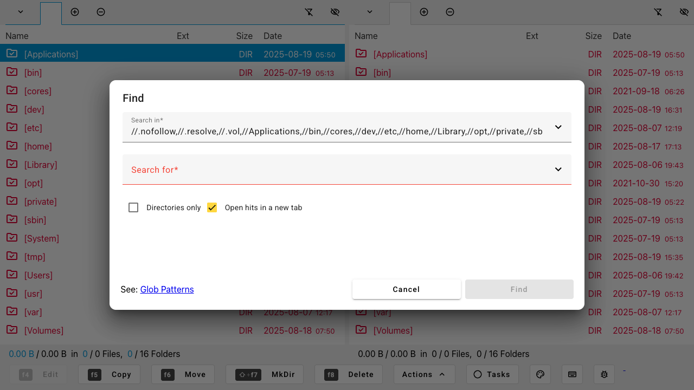

# 🗂️ Files and Folders

[](https://hub.docker.com/r/krocon/files-and-folders-mr)
[](https://angular.io/)
[](https://nestjs.com/)
[](https://www.typescriptlang.org/)
[](https://openai.com/)
[](LICENSE)

> **The Next-Generation File Manager** - A powerful, AI-enhanced orthodox file manager that revolutionizes how you
> interact with your files and folders.

## ✨ Why Choose Files and Folders?

**Files and Folders** isn't just another file manager—it's your intelligent file management companion. Built with
cutting-edge technology and powered by AI, it transforms mundane file operations into effortless, intelligent workflows.

### 🚀 **Key Highlights**

- 🤖 **AI-Powered Operations** - Let GPT-4 intelligently rename and organize your files
- 🎯 **Orthodox Interface** - Classic dual-pane design with modern Angular 20 technology
- 🖥️ **Cross-Platform** - Works seamlessly on Windows, macOS, and Linux
- 🐳 **Docker Ready** - Deploy anywhere with one command
- ⚡ **Lightning Fast** - Built with TypeScript, Angular 20, and NestJS
- 🎨 **Fully Customizable** - Themes, shortcuts, and UI to match your workflow

---


<style>
.theme-showcase {
  position: relative;
  width: 100%;
  height: auto;
  max-width: 1280px;
  min-height: 720px;
  margin: 0 auto;
  overflow: hidden;
}

.theme-image {
  position: absolute;
  top: 0;
  left: 0;
  width: 100%;
  height: auto;
  opacity: 0;
  transition: opacity 1s ease-in-out, transform 1s ease-in-out;
  animation: smoothThemeRotate 24s infinite;
  transform: scale(1);
}

.theme-image:nth-child(1) { animation-delay: 0s; }
.theme-image:nth-child(2) { animation-delay: 3s; }
.theme-image:nth-child(3) { animation-delay: 6s; }
.theme-image:nth-child(4) { animation-delay: 9s; }
.theme-image:nth-child(5) { animation-delay: 12s; }
.theme-image:nth-child(6) { animation-delay: 15s; }
.theme-image:nth-child(7) { animation-delay: 18s; }
.theme-image:nth-child(8) { animation-delay: 21s; }

@keyframes smoothThemeRotate {
  0% { opacity: 0; transform: scale(1.02); }
  4.17% { opacity: 1; transform: scale(1); }
  8.33% { opacity: 1; transform: scale(1); }
  12.5% { opacity: 0; transform: scale(0.98); }
  100% { opacity: 0; transform: scale(0.98); }
}
</style>

<div class="theme-showcase">
  
  
  
  
  
  
  
  
</div>

---

## 🎯 **Core Features**

### 🤖 **AI-Enhanced File Management**

- **Smart Rename**: AI-powered batch renaming with natural language prompts
- **Intelligent Grouping**: Automatically organize files into logical folders
- **Context-Aware Suggestions**: Get intelligent recommendations for file operations
- **Multiple AI Models**: Support for OpenAI GPT-4 and Llama models

### 📁 **Advanced File Operations**

- **Multi-Rename Tool**: Batch rename with regex patterns and AI assistance
- **Multi-Directory Creation**: Create complex folder structures instantly
- **Pack/Unpack**: Handle archives with ease (ZIP, TAR, etc.)
- **Advanced Search**: Find files with powerful filtering options
- **Goto Anything**: Quick navigation with fuzzy search

### 🖥️ **Professional Interface**

- **Dual-Pane View**: Classic orthodox file manager layout
- **Tabbed Interface**: Multiple locations open simultaneously
- **Built-in Terminal**: Integrated shell with full xterm.js support
- **Task Manager**: Monitor background operations in real-time
- **Customizable Themes**: Personalize colors and appearance

### ⚡ **Power User Features**

- **Keyboard Shortcuts**: Fully customizable hotkeys for every action
- **Bookmarks & History**: Quick access to frequently used locations
- **Hidden Files Support**: Toggle system and hidden file visibility
- **Clipboard Integration**: Copy file paths and names as text or JSON
- **External Program Launcher**: Launch applications directly from the file manager

---

## 📸 **Screenshots**

> *Experience the power of AI-enhanced file management*

### 🖥️ **Main Interface**

The clean, modern interface with dual-pane file management and integrated terminal:


### 📋 **Application Menu**

Access all features through the comprehensive menu system:


### 🔍 **Search & Navigation**

#### Goto Anything Dialog

Quick navigation with fuzzy search capabilities:


#### Find Files Dialog

Advanced search with powerful filtering options:



### 📁 **File Operations**

#### Multi-Rename Tool

AI-powered batch renaming with regex patterns:


#### Directory Operations

Create multiple directories with complex structures:


#### File Management

Copy, move, and organize files efficiently:


### 🗜️ **Archive Operations**

Pack and unpack archives with ease:


### 🤖 **AI-Powered Features**

#### Group Files Dialog

Intelligent file organization with AI assistance:


### 💻 **Terminal Integration**

Built-in terminal with full xterm.js support:


### ⚙️ **Configuration**

#### Application Settings

Configure all aspects of the file manager:


### 📊 **Task Management**

Monitor background operations in real-time:


---

## 🚀 **Quick Start**

### Option 1: Docker (Recommended)

**Single Command Setup:**
```bash
docker run -p 3333:3333 -p 3334:3334 \
  -v /:/fnf \
  -e FNF_OPENAI_API_KEY='your-openai-key-here' \
  -e FNF_START_PATH='/fnf' \
  --name files-and-folders \
  krocon/files-and-folders-mr
```

**Access your file manager at:** `http://localhost:3333`

### Option 2: Docker Compose

Create `docker-compose.yml`:

```yaml
services:
  files-and-folders:
    image: krocon/files-and-folders-mr
    container_name: fnf
    ports:
      - "3333:3333"
      - "3334:3334"
    volumes:
      - /:/fnf
    environment:
      - FNF_OPENAI_API_KEY=your-openai-key-here
      - FNF_OPENAI_API_URL=https://api.openai.com/v1/chat/completions
      - FNF_OPENAI_MODEL=gpt-4
      - FNF_START_PATH=/fnf
      - NODE_ENV=production
    restart: unless-stopped
```

```bash
docker compose up -d
```

### Option 3: Development Setup

```bash
# Clone and install
git clone <repository-url>
cd files-and-folders-mr
npm run pnpm-i

# Build all components
npm run build:all

# Start services
npm run start:fnf-api    # Backend (port 3000)
npm run start:fnf        # Frontend (port 4200)
```

---

## 🤖 **AI Configuration**

To unlock the full power of AI features, configure your OpenAI API key:

### Environment Variables
```bash
export FNF_OPENAI_API_KEY="sk-your-openai-api-key-here"
export FNF_OPENAI_MODEL="gpt-4"
export FNF_AI_COMPLETION_SERVICE="openai"
```

### Supported AI Models

- **OpenAI GPT-4** (Recommended)
- **OpenAI GPT-3.5-turbo**
- **Llama Models** (Local deployment)

### AI Features in Action

- **"Rename these photos by date and location"** → Intelligent batch renaming
- **"Group these files by project type"** → Smart folder organization
- **"Clean up this downloads folder"** → Automated file sorting

---

## 🛠️ **Configuration**

### Keyboard Shortcuts

Fully customizable shortcuts for power users:

- `Ctrl+C` - Copy files
- `Ctrl+V` - Paste files
- `F5` - Refresh view
- `F6` - Move files
- `F7` - Create directory
- `F8` - Delete files
- `Ctrl+Shift+T` - Open terminal here

### Themes & Appearance

- **Dark Mode** - Easy on the eyes
- **Light Mode** - Clean and bright
- **Custom Colors** - Match your desktop theme
- **Font Customization** - Choose your preferred typeface

---

## 🏗️ **Architecture**

**Modern Tech Stack:**

- **Frontend**: Angular 20 + TypeScript + Material Design
- **Backend**: NestJS + Node.js + Express
- **AI Integration**: OpenAI API + Custom completion services
- **Terminal**: xterm.js for full shell integration
- **Build**: Webpack 5 + Angular CLI
- **Testing**: Jest + Cypress

**Project Structure:**

```
files-and-folders-mr/
├── apps/
│   ├── fnf/           # Angular 20 Frontend
│   └── fnf-api/       # NestJS Backend API
├── libs/
│   └── fnf-data/      # Shared TypeScript Models
├── docker-compose.yml # Container orchestration
└── package.json       # Monorepo configuration
```

---

## 🧪 **Development**

### Prerequisites

- Node.js ≥ 18.0.0
- pnpm ≥ 8.0.0
- Docker (optional)

### Environment Variables

| Variable                      | Description                                                                    | Default                                                                |
|-------------------------------|--------------------------------------------------------------------------------|------------------------------------------------------------------------|
| **FNF_FRONTEND_HOST**         | Host URL for the Angular frontend application                                  | `http://localhost:` + frontend port                                    |
| **FNF_FRONTEND_PORT**         | Port for the Angular frontend application                                      | `4201`                                                                 |
| **FNF_BACKEND_PORT**          | Port for the NestJS backend API server                                         | `3333`                                                                 |
| **FNF_WEBSOCKET_PORT**        | Port for the WebSocket server communication                                    | `3334`                                                                 |
| **FNF_ASSETS_ROOT**           | Root directory path for application assets                                     | `/usr/src/app/apps/fnf-api/assets` (Docker) or `../src/assets` (local) |
| **FNF_INCOMPATIBLE_PATHS**    | Comma-separated list of paths that should be avoided or blocked                | _(none)_                                                               |
| **FNF_START_PATH**            | Initial directory path when the file manager starts                            | User home directory (Windows) or `/` (Unix/Linux)                      |
| **FNF_CONTAINER_PATHS**       | Comma-separated list of container mount paths, used as fallback for start path | _(none)_                                                               |
| **FNF_DOCKER_ROOT**           | Docker container root path for file system operations                          | _(none)_                                                               |
| **FNF_OPENAI_API_URL**        | OpenAI API endpoint URL for AI completion services                             | `https://api.openai.com/v1/chat/completions`                           |
| **FNF_OPENAI_API_KEY**        | OpenAI API key for authentication (required for AI features)                   | _(empty string)_                                                       |
| **FNF_OPENAI_MODEL**          | OpenAI model to use for AI completions                                         | `gpt-4`                                                                |
| **FNF_LLAMA_API_URL**         | Llama API endpoint URL for local AI completion services                        | `http://localhost:11434/api/generate`                                  |
| **FNF_LLAMA_API_KEY**         | Llama API key for authentication                                               | _(empty string)_                                                       |
| **FNF_LLAMA_MODEL**           | Llama model to use for AI completions                                          | `llama3`                                                               |
| **FNF_AI_COMPLETION_SERVICE** | Which AI service to use for completions (`openai` or `llama`)                  | `openai`                                                               |

> **Note**: The `FNF_START_PATH` follows a priority order: environment variable → first path from
`FNF_CONTAINER_PATHS` → user home directory (Windows) → root directory `/` (Unix/Linux).

### Build Commands
```bash
npm run build:all      # Build everything
npm run test           # Run all tests
npm run e2e            # End-to-end tests
npm run docker:build   # Build Docker image
```

### Testing

- **Unit Tests**: Jest for components and services
- **E2E Tests**: Cypress for user workflows
- **API Tests**: Automated backend testing

---

## 🌟 **Use Cases**

### For Developers

- **Project Management**: Navigate codebases with dual-pane efficiency
- **Build Automation**: Integrated terminal for development workflows
- **File Organization**: AI-powered sorting of assets and dependencies

### For Content Creators

- **Media Management**: Organize photos, videos, and assets intelligently
- **Batch Operations**: Rename hundreds of files with AI assistance
- **Archive Handling**: Extract and create archives seamlessly

### For System Administrators

- **Server Management**: Remote file operations via web interface
- **Log Analysis**: Navigate and search through system logs
- **Backup Operations**: Organize and verify backup archives

### For Power Users

- **Productivity**: Keyboard-driven file operations
- **Customization**: Tailor the interface to your workflow
- **Automation**: Script complex file operations

---

## 🤝 **Contributing**

We welcome contributions! Here's how to get started:

1. **Fork** the repository
2. **Create** a feature branch: `git checkout -b feature/amazing-feature`
3. **Commit** your changes: `git commit -m 'Add amazing feature'`
4. **Push** to the branch: `git push origin feature/amazing-feature`
5. **Open** a Pull Request

### Development Guidelines

- Follow TypeScript best practices
- Write tests for new features
- Update documentation
- Ensure Docker compatibility

---

## 📄 **License**

This project is licensed under the MIT License - see the [LICENSE](LICENSE) file for details.

---

## 🙏 **Acknowledgments**

- **Angular Team** - For the amazing framework
- **NestJS Team** - For the powerful backend framework
- **OpenAI** - For AI capabilities that transform file management
- **xterm.js** - For excellent terminal integration
- **Community Contributors** - For making this project better

---

## 📞 **Support**

- 💬 **Issues**: [GitHub Issues](https://github.com/your-repo/issues)
- 📖 **Documentation**: [Wiki](https://github.com/your-repo/wiki)
- 🐳 **Docker Hub**: [krocon/files-and-folders-mr](https://hub.docker.com/r/krocon/files-and-folders-mr)

---

<div align="center">

**⭐ Star this repository if you find it useful! ⭐**

*Built with ❤️ by developers, for developers*

</div>


